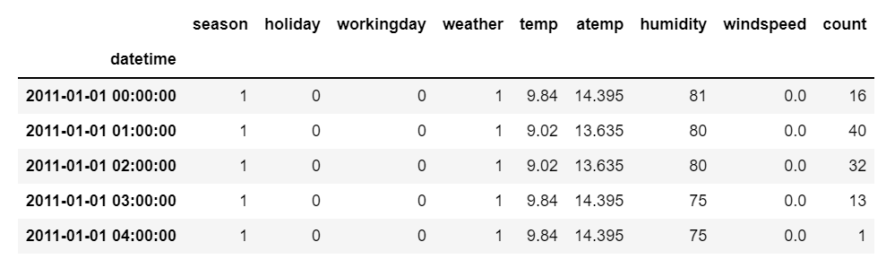
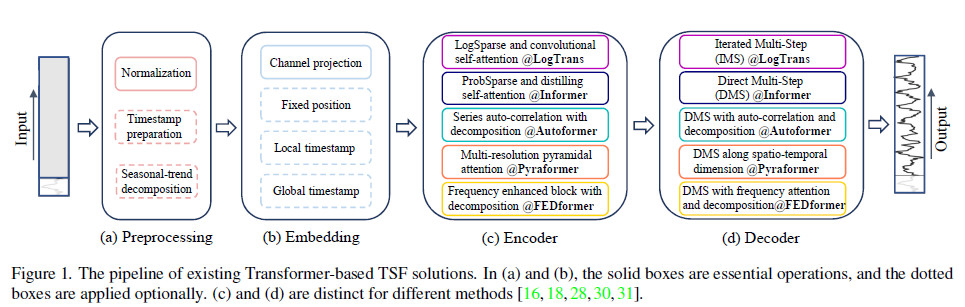

# Outline
# 比赛内容
## 问题重述
训练集数据为不同10个风电场近一年的运行数据共30万余条，每15分钟采集一次，包括风速、风向、温度、湿度、气压和真实功率等。我们需要设计一种利用当日5:00前的数据，预测指定的某个风电场次日00:00-23:45实际功率的多元时间序列预测方法。准确率按日统计，根据10个风电场平均准确率进行排名。

风电预测的意义在于电力市场竞价和风电场运行维护。风电场作为并网电源，需要参与日前市场竞价，因此对风电功率预测的依赖性和需求度越来越大。风电的间歇性将大大削弱风电的竞争力 , 而且还会由于供电的不可靠性受到经济惩罚。对风电场来说，风电功率预测有助于企业合理安排检修计划，选择无风或低风时间段 , 即风电场出力小的时间 , 对设备进行维修。
## 数据集
### 数据集字段说明
|  字段名   | 描述  |
|  ----  | ----  |
| DATATIME  | 数据采集时间 |
| WINDSPEED  | 预测风速 |
| PREPOWER |  |
| WINDDIRECTION | 风向 (0-360) 以度为单位 |
| TEMPERATURE | 温度 |
| HUMIDITY | 湿度 |
| PRESSURE |气压 以百帕为单位 (标准大气压1014百帕)|
| ROUND(A.WS,1) | 实际风速 |
| ROUND(A.POWER,0) | 预测目标，计量口径一 |
| YD15| 实际功率(预测目标，计量口径二) |
### 数据集说明
训练数据分为11个表格，其中第四个风电场数据分为两个表格。不同风电场的时间戳序列也不是一一对应的。
# 关键技术
## 数据预处理

## 多元时间序列（MTS）
多变量时间序列具有一个以上的时间依赖变量。每个变量不仅取决于其过去的值，而且还对其他变量有一定的依赖性。这种依赖性用于预测未来的价值。

## MTS-Mixers
### 背景
-   MTS-Mixers是多变量时间序列预测技术，其在实践中应用广泛，包括电力和天气预测以及交通流量估计等。
-   随着计算资源和模型架构的扩展，深度学习技术，包括基于RNN和CNN的模型，已被证明在预测方面比传统的统计方法表现更好。最近，基于Transformer的模型由于其捕捉长期依赖关系的能力，在预测任务中也显示出了显著的潜力。
- 本文明确了一点transformer模型对于时间序列预测的有效性问题。之前在NLP或者CV的研究中发现用MLP层替换attention层可以得到更好的表现，此模型同样引入了相对attention来说较为简单的MLP。
### 方法
- 理论基础是利用Factorized MLP的方法来捕捉多变量时间序列预测中的时间和通道相关性。
- 提出了一种新的方法MTS-Mixers，它使用两个分解模块来捕捉时间和通道相关性，从而提高预测准确性和效率。(Lee-Thorp et al. 发现分开获取时间和维度特征信息可以获得更好的模型表现)
### 创新点
- 
### 结论
- 发现attention不是捕捉时间相关性的必要手段，并且时间相关性和通道相关性之间的纠缠和重叠会影响预测性能。为了克服这些挑战，提出了MTS-Mixers，它使用两个分解模块来捕捉时间和通道相关性。MTS-Mixers已经在多个公共实际多变量时间序列数据集上达到了最先进的预测性能，平均降低了15.4％的MSE(均方误差)和12.9％的MAE(平均绝对误差)。
### 官方实现
[plumprc/MTS-Mixers: MTS-Mixers: Multivariate Time Series Forecasting via Factorized Temporal and Channel Mixing (github.com)](https://github.com/plumprc/MTS-Mixers)

## 基于Transformer模型的时间序列建模
基于Transformer的时间序列建模方法，是一种具有潜力的新型时间序列预测方法。这种方法能够很好地处理时间序列的长依赖、异步等问题，从而提升了预测的准确度，并具有可扩展性、通用性等优点。这一方法的提出为未来时间序列建模提供了一种新的思路和方向。

### 背景
- 在传统的时间序列模型中，如ARIMA和VARMA等模型，人们通常根据时间序列的观测历史来预测未来时间的状态。然而，这些模型的预测能力有限，并且需要人为地制定模型参数。为了解决这些问题，人们开始尝试使用深度学习模型来完成时间序列预测任务。
- 随着近年来深度学习技术的兴起，人们开始尝试将其引入到时间序列建模中，以获得更好的预测效果。其中，基于LSTM的序列模型被广泛应用于时间序列预测中，但在部分实验中它们表现不稳定，且在不同的数据集上的表现差异较大。
- Transformer模型是自然语言处理领域中一种新型的深度学习模型，具有极强的自我学习和表达能力。本文借鉴了Transformer模型的思路，提出了一种基于Transformer的时间序列建模方法，尝试提升时间序列建模的预测效果和表达能力。
### 方法
- 本文采用了将时间序列数据转换为序列格式的方法。具体而言，本文将时间序列数据作为输入，将其变换为一个二维矩阵。通过矩阵的每一行来表示时间的信息，即在时间轴上的位置，而每一行的向量则表示该时间点对应的特征向量。这样，本文就得到了一个带有位置编码的文本向量。
- 将上述生成的文本向量传入Transformer的编码器部分，以获得输出。在编码器中，本文采用了多头自注意力机制模型，以便模型能够提取时间序列之间的时间依赖关系。在这样的架构中，每个注意力头关注权重不同的输入向量，并且它们最终被拼接在一起，以将注意力的效果更好地整合到一起。本文进一步加入了残差连接，以提升整个模型的性能。
- 为了减轻过拟合，并加快训练速度，本文还加入了对特征向量和位置编码向量的随机掩蔽。
### 创新点
- 将注意力机制引入时间序列预测中：在传统时间序列建模中，人们通常采用循环神经网络，如LSTM网络。而在本文中，作者将注意力机制引入时间序列预测建模中，使用Transformer网络。注意力机制使得模型可以更好地关注数据中有用的特征信息，并且在长时间序列数据中可以更好地捕捉到时间依赖关系，从而提升预测准确率。
- 使用位置向量加入时间信息：为了在Transformer中引入时间信息，本文采用了一种将时间序列数据转换为带有位置向量的矩阵的方法。通过这样的方式，可以使得Transformer网络甄别出时间序列数据中每个时间点的位置信息，从而增加对时间序列的表达能力。
- 随机行掩蔽：除了常规的特征向量掩蔽方法，本文还采用了随机行掩蔽方法。在模型训练过程中，本文随机地生成一些位置向量，并将对应位置的特征向量替换为零向量。这样可以减轻模型对输入数据的依赖。
### 结论
- 在本文中，作者使用的基于Transformer的时间序列建模方法相较于传统方法具有多个优势。
- 首先，本文使用的模型可自动提取输入数据中的关键特征，自动处理缺失值等噪声，从而不需要繁琐的人工处理数据。
- 其次，本文采用的多头自注意力机制，在处理时间依赖关系时表现出更好的性能。此外，这种机制还可以增强模型对于一些时间序列特征的感知能力，从而更加优秀地完成预测任务。
- 第三，本文的方法具有更优的可解释性。在其他时间序列预测方法中很难明确特征的作用。而基于Transformer的模型通过自注意力机制可以直接关注时间序列数据中每个特征的重要性，从而使模型得到更具意义的特征表示，而这些特征中的每一个都塑造了最终的预测结果。
- 第四，相比于LSTM等传统方法，基于Transformer的方法训练效率更高，这是由于其使用了自注意力机制和并行化操作等技术，从而将训练时间缩短到数小时甚至几十分钟。
- 最后，实验结果显示，本文所提出的方法比常用的时间序列预测方法ARIMA、LSTM都具有更好的预测精度，并且在时间序列较长或区别较大的数据集上效果尤其显著，同时具备了较快的训练速度、较低的过拟合风险、以及更强的可解释性，这些都是传统时间序列预测方法所没有的属性。这进一步证实了基于Transformer的时间序列预测方法的优势。
### 官方实现
[Are Transformers Effective for Time Series Forecasting? (AAAI 2023)](https://github.com/cure-lab/LTSF-Linear)
# 软件创新点
## 可视化
在web端用threejs库做十个风力发电机的三维可视化模型，具体的位置数据是假想数据，可以参考2022 kdd风电赛道的空间数据。
## 实时更新与滚动预测
## 安排检修计划

# 实验验证
